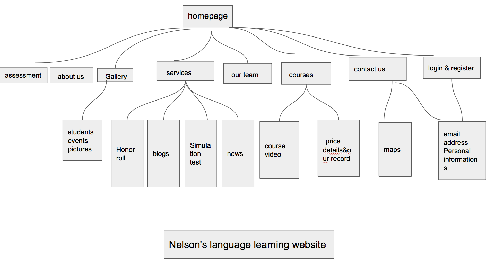
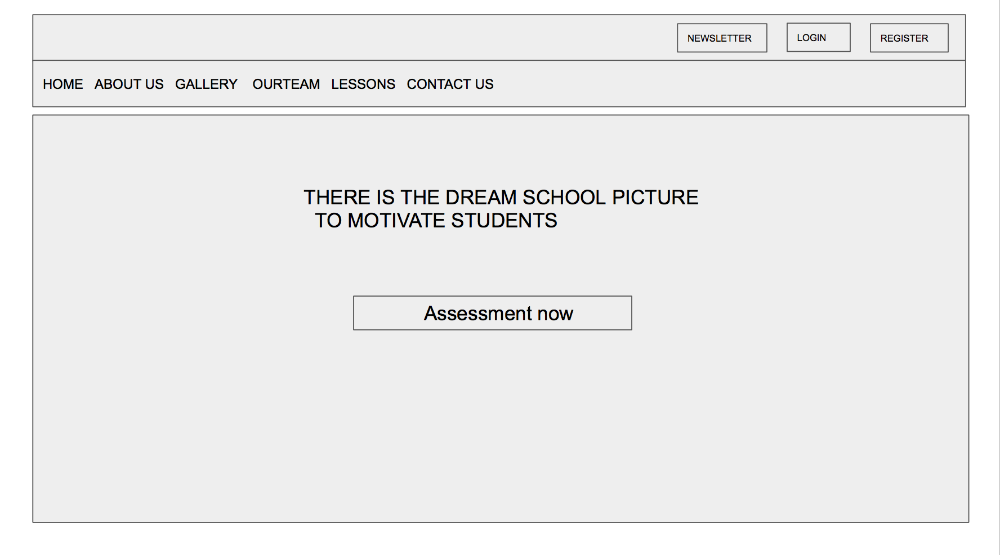
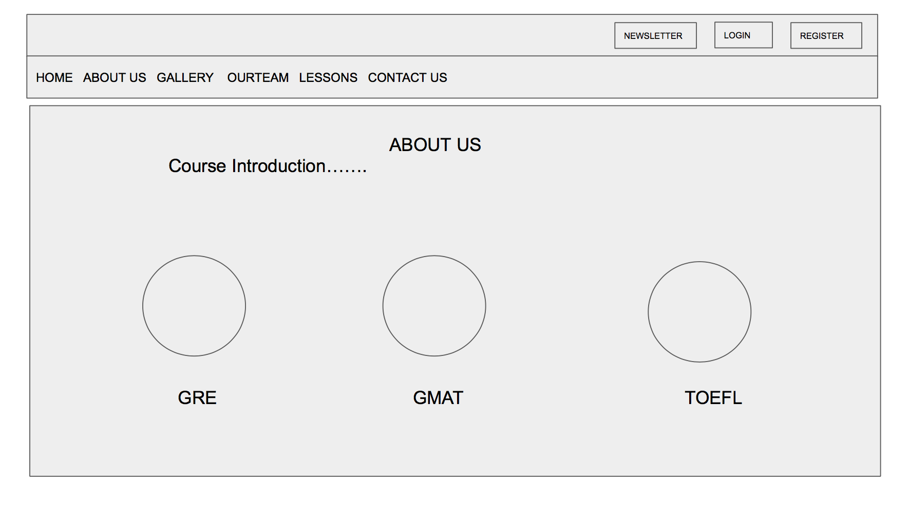
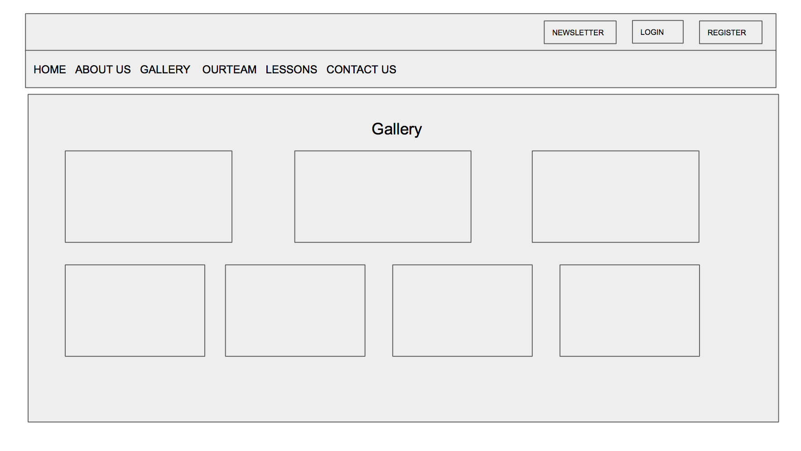
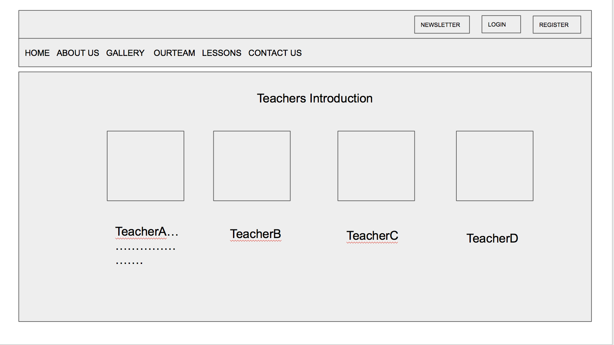
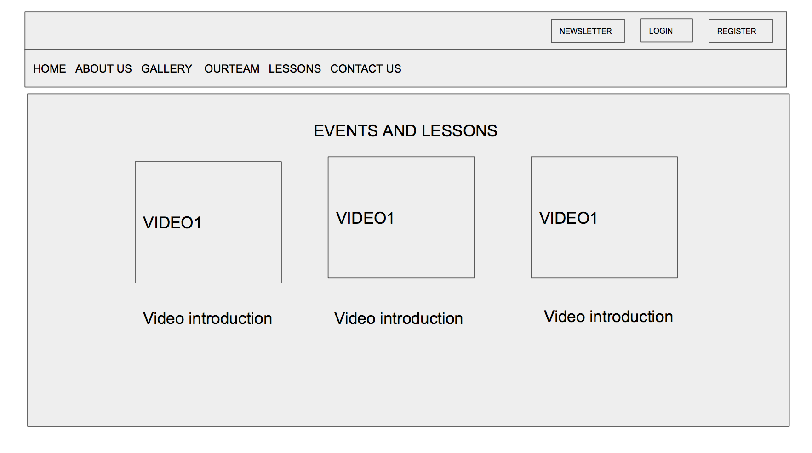
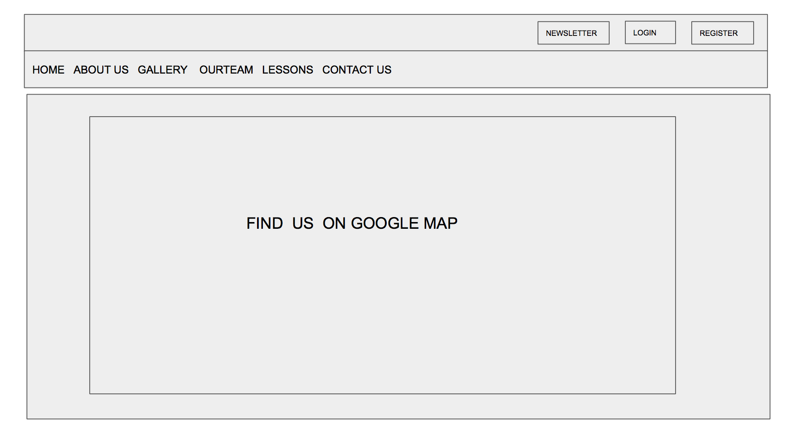
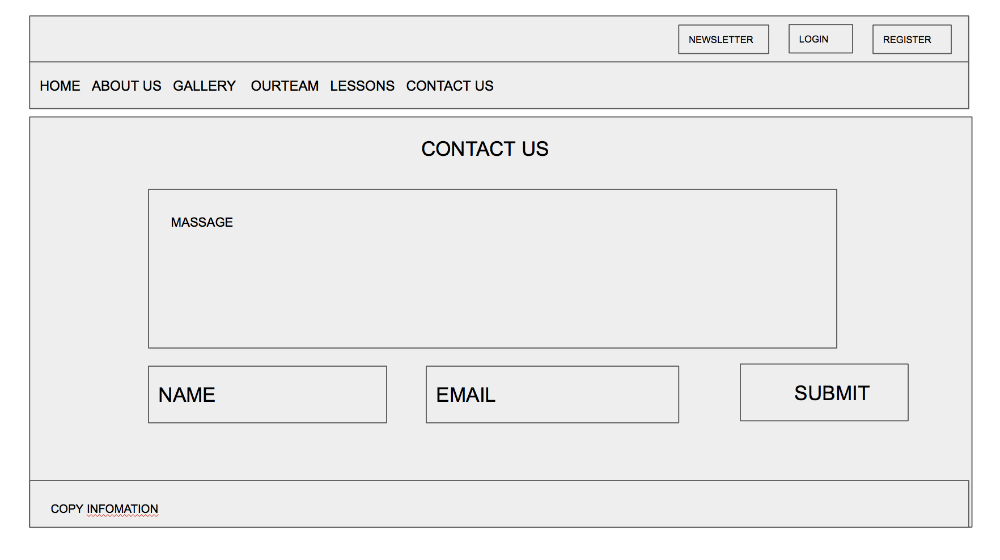

# MSTU 5003 Design Document (Template)

I would like to create a website that can learn English online, which is aimed at students who wish to study in the United States, rather than zero-based children. So I would like to add the simulation test questions of the main test subjects of US University. such as the TOEFL test, GRE test, as well as GMAT test simulation questions. Students can practice online. At the same time, we provide online courses, students can pay classes, to accept the world's best English teacher's teachings. Home to be able to accept the authority of high level training teacher guidance. And in addition to the live course, you can also watch the course video; We also provides one-on-one online interactive teaching. All teachers receive online booking courses, more targeted for those who want to individual help students.
 In final, I plan to improve some of the content. Add the relevant test question simulation, online questions, and join the community culture, allowing registered users to share online learning experience. And ask the excellent students to share their experience.
 In addition, I will add the relevant extended reading link, so that through my platform with other existing resources for a good communication. I try to creat interactive pop-up window, so that when someone opens my page, that there will be a relevant customer service staff on-site consulting services. Try to motivate all students register. After the user registration, we will get the large data about how these user use our website. Concerned about the user interested in the topic, and then regularly push the relevant content, to provide users with the most valuable subscription service. At the same time, I plan to continue to optimize the content services, refine the content, so that the target audience will be more clearly. And the customers will easy and clear to understand all of the courses we offer. And clearly in the page to find the desired content. My teaching page, that is, a platform to share the exchange, but also a quick break test scores training base. My goal is to get high scores. The customer is very clear that who want to participate in these subjects examination, and hope to study in the United States students. Through a large number of online contact simulation questions, training the testing feeling. At the same time there are special exams Q & A. This is our teaching model. You can choose one-on-one, or one-to-many. So that we can refine the price of different products.

Midterm my teaching content is relatively missing. In Final I hope to add more, and with the most effective and not the most exaggerated way to keep my customers. Quickly raise scores, that is my profit approach.

## Topic
This is a learning language teaching site. Learning a language first is a long and complicated process, need to remember a lot of new words, familiar with the syntax of various sentences, and continue to practice. In listening, speaking, reading and writing a all need targeted practice, need the supervision of teachers, need a good learning language environment to do a lot of practice. So, I think learning English website also can used by the other subjects of learning, and even a variety of vocational skills training.

## Problem
I hope my website can solve the major difficulties of majority foreign students meet in learning new language.
1. students can’t persevere in learning, can’t remember the new words;
2. blind practice, slow to enhance the test score;
3. Lack of language environment, can’t interact practice after learning;
4.After obtaining excellent language scores, how to apply for school.

## Target Audience
Our website mainly aimed the high school and college students who want to study in United States. Students who have a certain language base but without language environment to practice and lack of understanding of the form of the language tests. Students who hope to get the most authoritative and training.

### User Stories
- **User Story 1:**
I have a five years of media work experience, and have passed the Chinese English Test 6. But because lack of language environment, my spoken and listening English are very poor. At the same time do not understand the TOEFL test, hope to detour.  My dream school is Columbia University. So it need high score of English test, like TOEFL more than 100, GRE more than 320.  Chose an online course that will allow me keep on working and part time learning, without having to resign, and at the same time don’t need to spend more time on transportation and other issues. Online courses save a lot of cost. As a slightly older adult with a certain degree of self-discipline, I think it is very suitable. Five Star!

- **User Story 2:**
A friend introduced me to study here. I am a student of Peking University. My professional grades are good, but English is weak. So as a  computer science professional students, the best education of this major is in the United States, so when I was just a freshman, I have developed a future plan to study in the United States. One day in the Moments of WeChat I saw the introduction of this language learning site. After reading more details of this website, I have registered. Only one lesson per week. I have maintained the continuity of the course, while not delaying the normal university assignment. After six months study, I successfully got the TOEFL test, score of 110 points, this result is enough to apply for a good school in the United States. I am very happy.

- **User Story 3:**
My name is Jacke. I  live in the United States, my English daily communication is no problem. Although the United States has a very good language environment, but for the English test, there is no targeted courses to help us improve the score. I have tested three times of GRE has been only 308 points of the scores. It can’t pass the requirements of Harvard University. Especially the mathematics part, I only test 153 points, which is a poor score, the average Chinese students are more than 163 points, so I need related counseling courses. In this regard, China's examination-oriented education can do a good job, you can quickly improve the score, so some of my friend who have used this Online course introduce it to me. The course is very cheap than the normal study in the classroom. There is no need to fly back to China, just need to communicate with the teacher online, complete the assignments can improve the score. Through two months effort, I finally achieved a good score of 328 points. So i strongly recommend you guys try to use this Online course. And with the counseling of teacher and many alumni of ivy, my application is very smooth, has received Harvard University’s offer in March this year. That amazing, and high efficiency.

## Strategy
There are many online learning sites on internet, but the target audience is different. In order to reflect the results of the strategy, my website chose to focus on the US university entrance examination, focusing on teaching questions and skills. Unlike other teaching for children English-speaking enlightenment, as well as high-end business English, we choose to differentiate the competition.

### Site Objectives:
I would like to promote our courses through the website, but also for students from all over the world to provide a better explanation. The site is the most convenient way. Our goal is to provide students with the most authoritative and tailor-made courses for those who want to take part in TOEFL and GRE examinations to quickly improve student achievement. And to provide students with one-stop study application counseling services. Hoping to help more students get the ideal American school as soon as possible.

### Success Metrics
The results are oriented Everything. By statistic the number of registering students and who participating in interactive activities in the website forum to determine the initial results of the site. Through the students' test scores, the average enhance scores to evaluation of the site teaching results. Through the US institutions of admission and the rate to determine the results of the application and counseling.

## Scope
Provide a variety of US college entrance examination content, focusing on the Chinese students no matter in china or in the US, who wants to study in the United States. The training area focuses on several exams required by American institutions. Do the most professional training and guidance.

## Structure
The American examination system is constantly updated, the method of examination, the difficulty of the title, etc., need accurate teaching research and timely information. We are committed to providing the latest news and teaching results show and share it to the registered users.

## Skeleton
In the navigation bar, i will provide a detailed description of the website, teachers introduction, teaching results, and set aside interactive platform to organize online or offline activities. Provide user registration, consultation and payment services.

